# Memory benchmark atlas and FLA hybrid-model fit

This is the publication-facing visual index for the memory programme. It adds
no new benchmark observations. Every quantitative panel is regenerated from a
frozen aggregate artifact by
[`plot_memory_benchmark_atlas.py`](../../src/plot_memory_benchmark_atlas.py),
and [`figure_manifest.json`](../figures/memory_benchmark_atlas/figure_manifest.json)
records the exact source and figure hashes.

## Executive result

The [Flash Linear Attention hybrid-model interface](https://github.com/fla-org/flash-linear-attention#hybrid-models)
and this local programme address different levels of the stack:

- FLA supplies production-oriented linear/recurrent token mixers, local or
  full attention layers, fused operators, recurrent caches, Hugging Face model
  shells, training support, and evaluation entry points. Its `attn`
  configuration schedules attention layers at selected depths while omitted
  layers keep their native mixer.
- The local programme supplies memory-specific hypotheses and operator
  evidence: Schur/slot and delta laws, a shared Spin(8) action prior, a
  coarse-to-fine semantic router, actual selected-block state access, and a
  co-moving compiler around official FLA DeltaRule kernels.
- The natural integration is therefore a **third mixer type inside an FLA
  model**, not a replacement for FLA: local/full attention for recent or exact
  token interaction, native linear attention for global compression, and a
  sparse persistent-memory layer for targeted overwrite and recall.

That custom mixer is not yet registered as an FLA/Hugging Face layer. The
standalone fused gather is inference-only, has no backward kernel, and has not
been trained as part of a language model. Those are the decisive next gates.

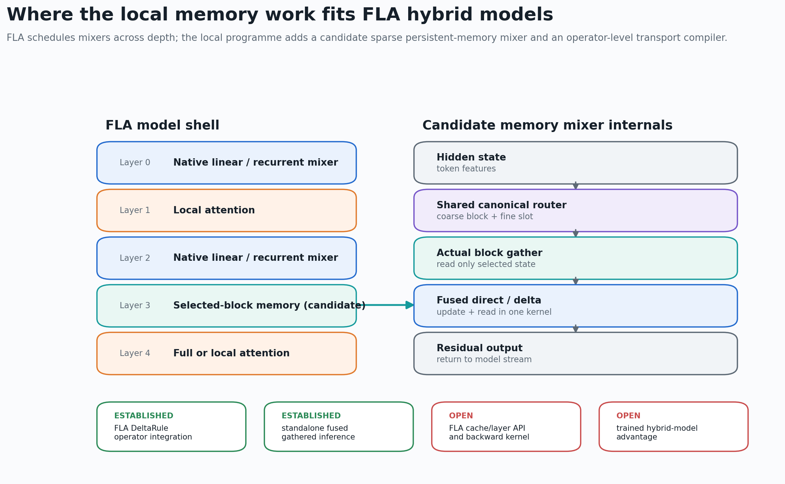

[Vector version](../figures/memory_benchmark_atlas/00_fla_hybrid_fit_map.svg)

## What the figures do and do not compare

The atlas deliberately separates four evidence cohorts:

| Cohort | Question | Primary statistic | Comparison boundary |
|---|---|---|---|
| Large-slot semantic hierarchy | Does shared cross-view structure improve routing, and does block selection reduce interference? | Mean query cosine and hard-route accuracy over 10 seeds | CPU float64 synthetic retrieval; not model quality |
| Task B action campaigns | Is the advantage an action/representation prior rather than a write-law advantage? | Length-2,048 mean query cosine by seed | Two distinct frozen cohorts; strict replay and prospective replication are not pooled |
| Fused gathered state | Does actual selected-state access reduce one-step latency and allocation? | Median of three independent process medians | RTX 2070 SUPER, fp32, recurrent inference step only |
| Matched core and FLA operators | How do local reference mechanisms compare with official FLA kernels? | Median latency over three independent processes | RTX 2070 SUPER, fp16; frozen state/shape contracts differ from the gathered-state campaign |

The atlas never puts quality scores and latency values on one axis, never
combines different hardware/dtype protocols into one ranking, and never reads
operator timing as a trained-model result.

## Campaign dashboard

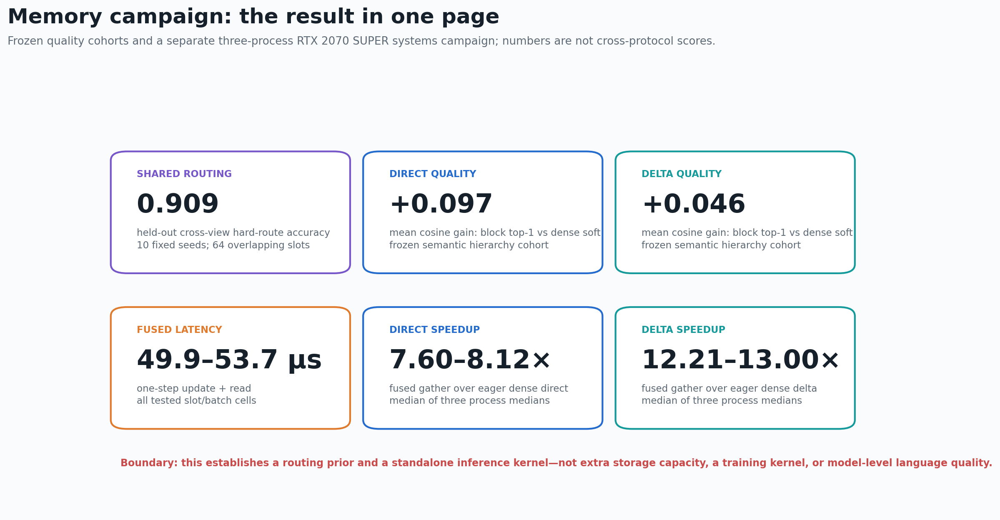

[Vector version](../figures/memory_benchmark_atlas/01_campaign_dashboard.svg)

The dashboard's six headline values have narrow meanings:

- `0.909` is the mean held-out hard-route accuracy of the shared router over
  the frozen 10-seed, 64-slot semantic cohort.
- `+0.097` direct and `+0.046` delta are mean block-top-1 improvements over
  dense-soft retrieval in that cohort.
- `49.9`--`53.7` microseconds is the complete tested range of the fused
  one-step kernel's median-of-process-medians latency.
- `7.60`--`8.12x` direct and `12.21`--`13.00x` delta are full-grid fused
  speedup ranges over their matching eager dense implementations.

These do not establish added storage capacity, a general model advantage, or
hardware-independent speed.

## Quality evidence

### Shared view completion

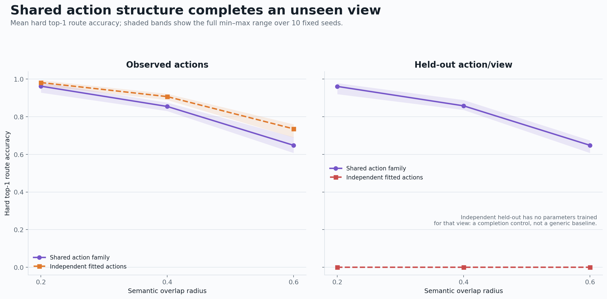

[Vector version](../figures/memory_benchmark_atlas/02_router_completion.svg)

The shared action family retains useful hard-route accuracy on an unseen
action/view. The independent held-out row has no parameters trained for that
view; it is a completion control, not evidence that independent routers are
generically unusable. On observed actions, the independent and shared families
are both strong.

The justified claim is therefore **cross-view completion from a supplied
shared action family**. It is not extra memory capacity and it is not yet
learned discovery of Spin(8) structure.

### Hierarchical interference reduction

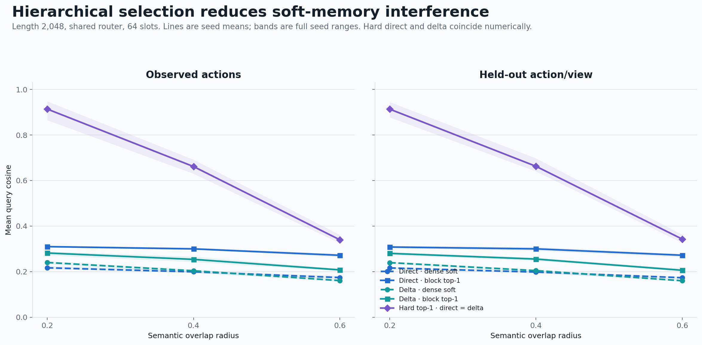

[Vector version](../figures/memory_benchmark_atlas/03_retrieval_quality.svg)

Block top-1 retrieval improves over dense soft retrieval for both direct and
delta memory. Hard top-1 direct and delta coincide to numerical precision,
which is the important negative control: with the correct discrete address,
the overwrite law is no longer the bottleneck. Quality still falls as semantic
overlap grows, so the remaining research target is routing under difficult
aliases rather than a more elaborate overwrite algebra.

### Task B: action prior, not write-law superiority

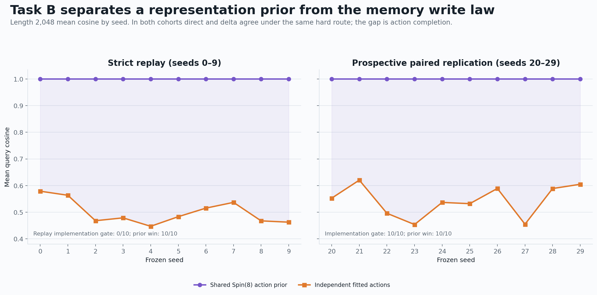

[Vector version](../figures/memory_benchmark_atlas/04_task_b_action_evidence.svg)

Both Task B cohorts show a large gap between the shared Spin(8) action family
and independently fitted actions at length 2,048. Direct and delta remain
identical under matched hard routing. The strict replay's implementation gate
failed `0/10` because the old soft-reproduction target was not reproduced;
that failure is retained visibly. The prospective paired replication passed
its implementation and representation-prior gates `10/10`.

The positive result is a reproducible representation-prior advantage on this
cross-view task. It is not a triality-specific memory-write advantage.

## Selected-state systems evidence

### Latency

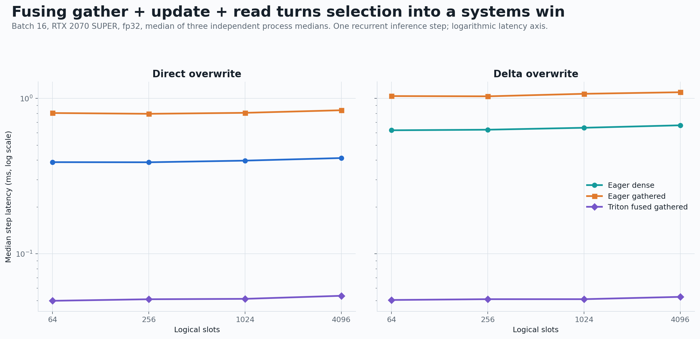

[Vector version](../figures/memory_benchmark_atlas/05_fused_latency.svg)

The eager gathered implementation is a correctness reference, not a systems
win: framework launch and indexing overhead make it slower than eager dense
updates. Fusing gather, update, and read into one Triton kernel reverses the
result and holds one-step latency near 50 microseconds across the frozen slot
grid at batch 16.

### Full-grid speedup

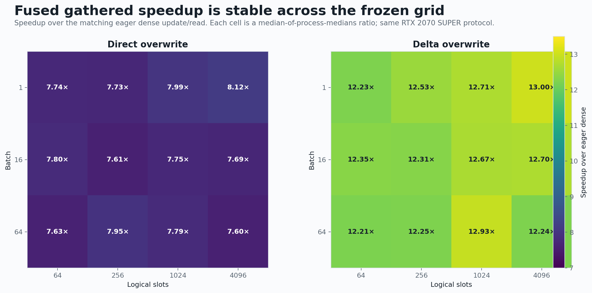

[Vector version](../figures/memory_benchmark_atlas/06_fused_speedup_grid.svg)

All twelve direct cells and all twelve delta cells retain the fused advantage.
The graph reports ratios computed from the aggregate's median process values;
it does not pool raw timing samples across processes.

### Incremental allocation

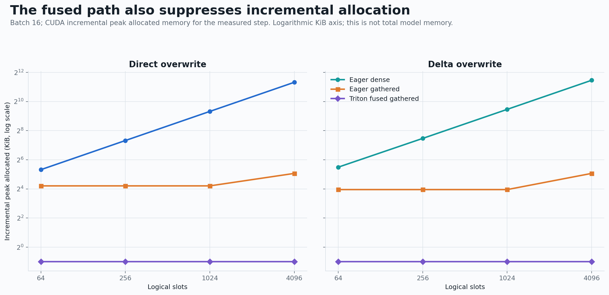

[Vector version](../figures/memory_benchmark_atlas/07_fused_incremental_memory.svg)

The fused kernel's measured incremental allocation stays small while eager
dense allocation grows with logical slot count. This is one-step CUDA
allocation, not total resident memory, model-cache size, or training memory.

## Production-baseline evidence

### Matched local cores

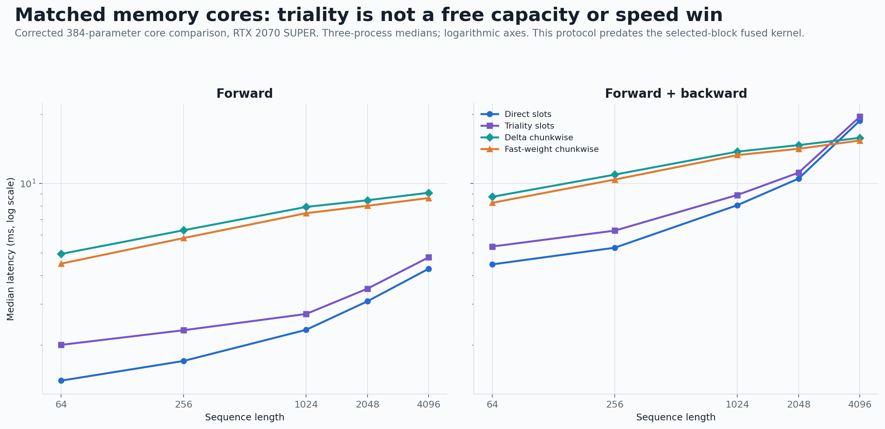

[Vector version](../figures/memory_benchmark_atlas/08_matched_core_scaling.svg)

Under the corrected 384-parameter core protocol, triality slots do not obtain a
free speed or capacity advantage over direct slots. Chunkwise delta and
fast-weight cores have different scaling profiles, but this campaign predates
the selected-block fused kernel and should not be used to infer its latency.

### Official FLA DeltaRule operators

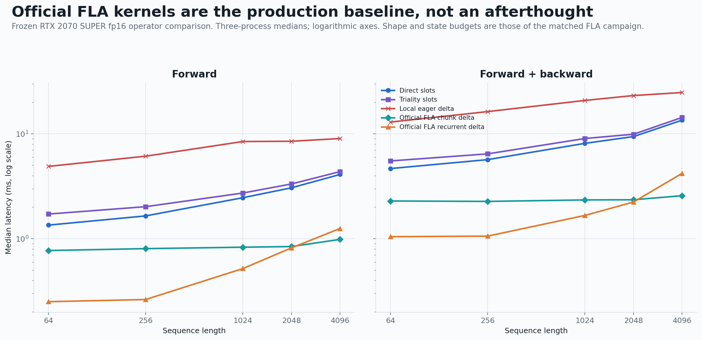

[Vector version](../figures/memory_benchmark_atlas/09_fla_delta_scaling.svg)

The local benchmark already invokes official FLA `chunk_delta_rule` and
`fused_recurrent_delta_rule` operators. In the frozen fp16 operator cohort, FLA
substantially outperforms the local eager delta reference, and the chunk path
stays near one millisecond through length 4,096. This validates FLA as the
systems baseline. It does not compare a complete Gated DeltaNet 2 layer,
encoder cost, or trained end-to-end quality.

### Noncommuting transport compiled around FLA

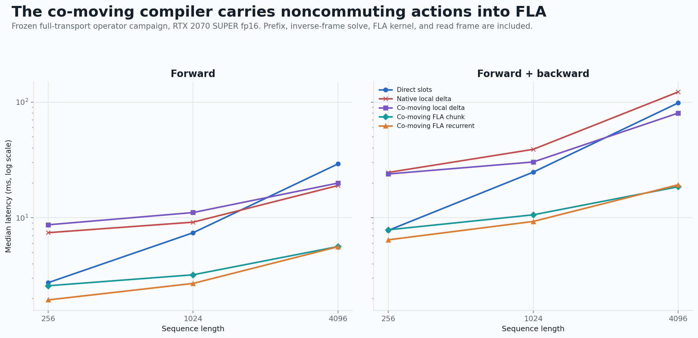

[Vector version](../figures/memory_benchmark_atlas/10_comoving_fla_scaling.svg)

The co-moving compiler performs the action prefix, inverse-frame solve,
official FLA update, and read-frame transform. At length 4,096, both compiled
FLA paths take about `5.6 ms` forward in the frozen cohort, versus about
`20.0 ms` for the co-moving local delta reference. This is an operator-level
integration result. It is not state-matched to every comparator and establishes
neither a Spin(8) capacity gain nor an absolute architecture winner.

## Strengths and weaknesses

### Local mechanisms

| Mechanism | Strengths established here | Weaknesses or open boundary |
|---|---|---|
| Direct slots | Exact hard overwrite; transparent semantics; strong reference oracle | Dense state traffic without selection; no benefit from triality under supplied correct routes |
| Delta memory | Exact parity with direct slots under one-hot hard routes; official FLA training-capable kernels exist | Soft continuous addresses erase/interfere; local eager implementation is not competitive |
| Shared Spin(8) action prior | Cross-view action completion; one canonical router can serve three related views | Requires supplied action/frame structure; no generic storage-capacity gain; the separate SO(3) cross-product intertwiner experiment prevents an exceptional-only interpretation |
| Hierarchical block selection | Reduces soft interference; exposes a sparse systems path; can share routing across views | Fine quality remains selector-limited; fixed block partition; selector cost is not yet embedded in a full model |
| Fused gathered kernel | Actual selected-state access; roughly 50-microsecond step; strong full-grid latency and allocation result | Inference-only custom Triton path; Windows/CUDA hardware-specific evidence; no backward or FLA cache API |
| Co-moving FLA compiler | Carries noncommuting value actions around official FLA kernels; differentiable operator path | Prefix/frame transforms cost work; comparison is not state-matched; no trained-model result |

### FLA as the host stack

| FLA strength | Why it matters here | What it does not solve automatically |
|---|---|---|
| Per-depth hybrid attention plan | Local/full attention can coexist with native recurrent mixers | The public `attn` plan selects attention versus the native mixer; a third custom memory type still needs model/block integration |
| Fused linear-attention operators | Provides the correct production baseline and a training path for delta updates | Does not supply the programme's shared canonical router or selected-block state layout |
| Recurrent generation cache | Natural home for persistent selected-block state | The current local fused state has not implemented FLA/Hugging Face cache semantics |
| Training and evaluation ecosystem | Enables honest end-to-end language and long-context tests | Operator speed alone does not predict quality, sample efficiency, or wall-clock training cost |
| Many maintained mixer families | Makes strong negative controls possible | A large architecture menu increases tuning degrees of freedom; comparisons must freeze budgets and schedules prospectively |

## Highest-value integration experiment

The next implementation should be a small, explicit FLA-compatible adapter,
not a new memory algebra:

1. Implement `SelectedBlockMemory` as a mixer with the same hidden-state,
   cache, dtype, device, and generation contracts as an FLA layer. Preserve a
   slow differentiable reference path and the current fused inference path.
2. Use official FLA chunk DeltaRule for the trainable/reference path, and use
   the co-moving compiler only where a task genuinely supplies cross-view
   actions. Add backward-equivalence and cache-replay tests before training.
3. Freeze four model variants: native FLA recurrent; FLA plus local attention;
   FLA plus local attention plus selected-block memory; and the same model with
   the shared Spin(8) router. Match parameter count, recurrent-state bytes,
   training tokens, optimizer, and measured CUDA budget.
4. Separate ordinary overwrite/recall from cross-view action/retrieval. The
   Spin(8) model should receive no special credit on ordinary tasks; the
   cross-view cohort is where its prior has a principled opportunity.
5. Report quality, sample efficiency, latency, allocated/reserved memory,
   router failures, and sequence-length extrapolation separately. Run a
   prospective multi-seed campaign only after the adapter passes reference,
   gradient, cache, and one-step kernel gates.

No Dirac--Gram global theorem is required for this integration. That theorem
belongs to a separate mathematical claim family and neither licenses nor
blocks an empirical memory-system test.

## Frozen sources

- [`large_slot_semantic_hierarchy_seeds30_39.json`](../../artifacts/large_slot_semantic_hierarchy_seeds30_39.json)
- [`task_b_delta_action_replay_seeds0_9.json`](../../artifacts/task_b_delta_action_replay_seeds0_9.json)
- [`task_b_paired_action_replication_seeds20_29.json`](../../artifacts/task_b_paired_action_replication_seeds20_29.json)
- [`fused_gathered_block_memory_cuda_aggregate_20260810.json`](../../artifacts/fused_gathered_block_memory_cuda_aggregate_20260810.json)
- [`matched_memory_cores_cuda_rtx2070s_frozen_aggregate_20260810.json`](../../artifacts/matched_memory_cores_cuda_rtx2070s_frozen_aggregate_20260810.json)
- [`fla_delta_rule_cuda_rtx2070s_frozen_aggregate_20260810.json`](../../artifacts/fla_delta_rule_cuda_rtx2070s_frozen_aggregate_20260810.json)
- [`comoving_fla_frozen_aggregate_20260810.json`](../../artifacts/comoving_fla_frozen_aggregate_20260810.json)

Regenerate all figures from the repository root with:

```powershell
python src/plot_memory_benchmark_atlas.py
```

Install the optional plotting dependency on a minimal environment with:

```powershell
python -m pip install -e ".[plots]"
```
